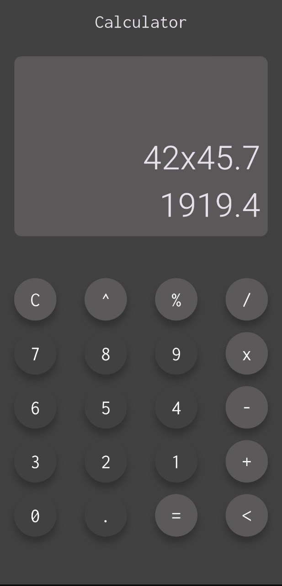

# 🧮 Simple Calculator App (Flutter)

A clean, minimal, and fully functional **calculator app** built using **Flutter**.  
This app performs basic arithmetic operations like addition, subtraction, multiplication, division, power, and percentage with a responsive UI.

---

## 📱 Preview

  

---

## ✨ Features

✅ Perform basic operations — `+`, `-`, `×`, `÷`, `%`, `^`  
✅ Supports floating-point numbers (e.g., `42 × 45.7`)  
✅ Prevents invalid input (like `--`, `**`, or trailing operators)  
✅ Displays both expression and evaluated result  
✅ Circular, modern buttons with elevation  
✅ Responsive layout compatible with multiple screen sizes  
✅ Clean and simple dark-themed UI

